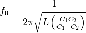
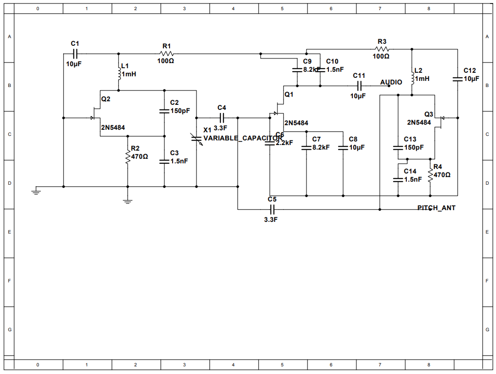
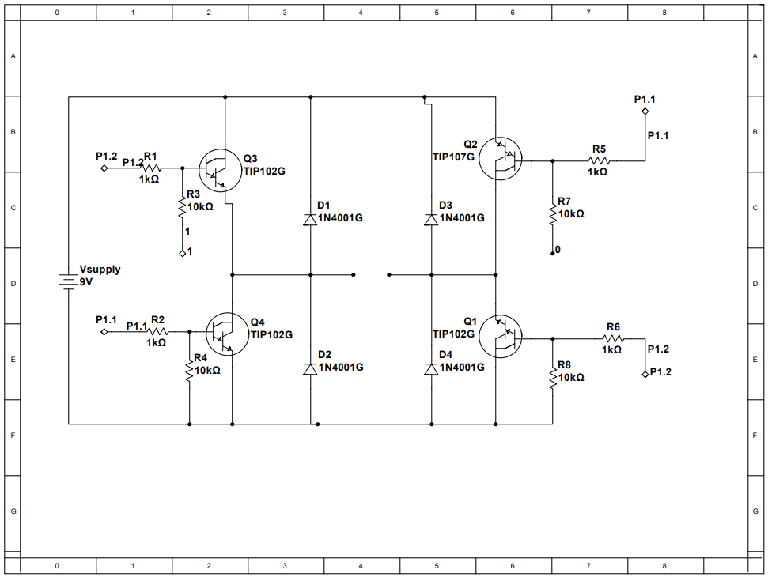

Human Capacitive Sensor and H-Bridge

Analog Feature 1: Fixed and Variable Colpitts Oscillator
The Colpitts oscillator is an LC oscillator with a transistor (I am using a JFET) that produces a smooth sinusoid of frequency



With a variable oscillator, the frequency is modified by the capacitance formed between an antenna and a conductive surface such as the human body. Our oscillators perform at around 440kHz, and detection of external capacitance changes the frequency. The difference between the two oscillators is calculated by the next analog feature, which should be in the range of 0Hz to 20kHz or the human audible range.

Analog Feature 2: Heterodyning Mixer / Active Rectifier
The mixer is a variant of the active rectifier which does not use diodes.



Digital Feature 1: Capacitive Sensor Control System
Our digital feature turns the capacitive sensor into a human proximity sensor by detecting the amplitude of the output. The closer a human is, the higher the capacitance and the higher frequency difference, translating into higher pitch. With the addition of a highpass filter, the microcontroller can detect the cutoff frequency of the filter.

Extra Analog Feature 1: H-Bridge Motor Controller
I implemented the H-Bridge as the motor controller.



Extra Digital Feature 1: H-Bridge Code
Code for integrating the sensors and the motor into a human following car.

```c
#include "math.h"
// Set sensing pin in
const int sensingPin = P1_6;
const float conversion = 0.0035;
float sensedAmplitude;
void setup()
{
  // put your setup code here, to run once:
  Serial.begin(9600);
  pinMode(sensingPin, INPUT);
  Serial.print("High: ");
  Serial.println(HIGH);
  Serial.print("Low: ");
  Serial.println(LOW);
  Serial.println("starting");
}
void loop()
{
// put your main code here, to run repeatedly:
// Serial messages for debugging:
  Serial.print("Voltage: ");
  sensedAmplitude = conversion*analogRead(sensingPin);
  Serial.println(sensedAmplitude);
  if (sensedAmplitude > 1) {
    moveForward();
}
else {
  stopMotor();
}
}
void moveForward() {
  digitalWrite(P2_0, HIGH);
}
void stopMotor() {
  digitalWrite(P2_0, LOW);
}
```